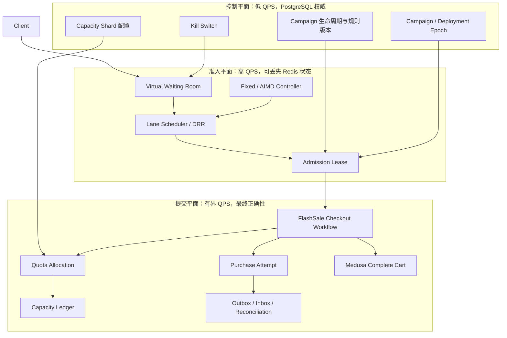
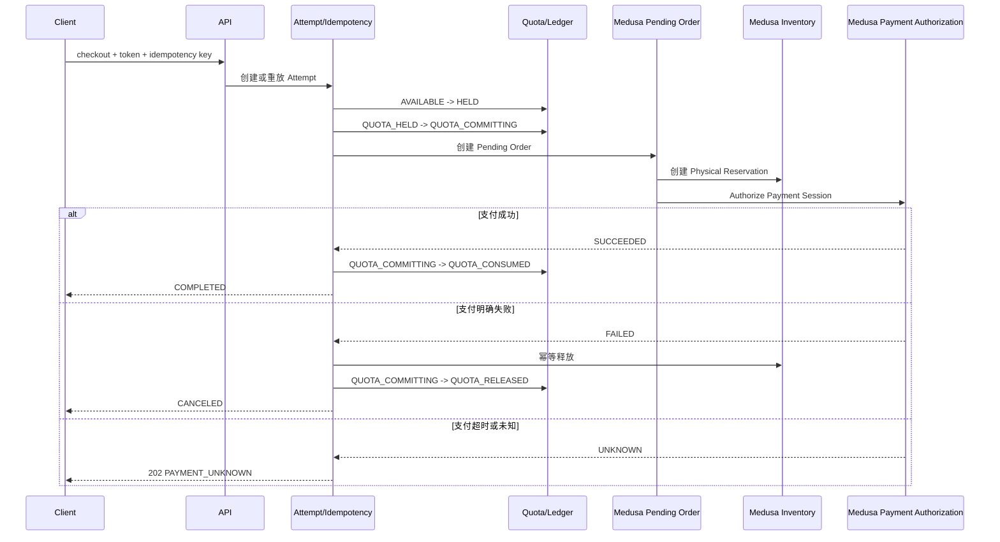
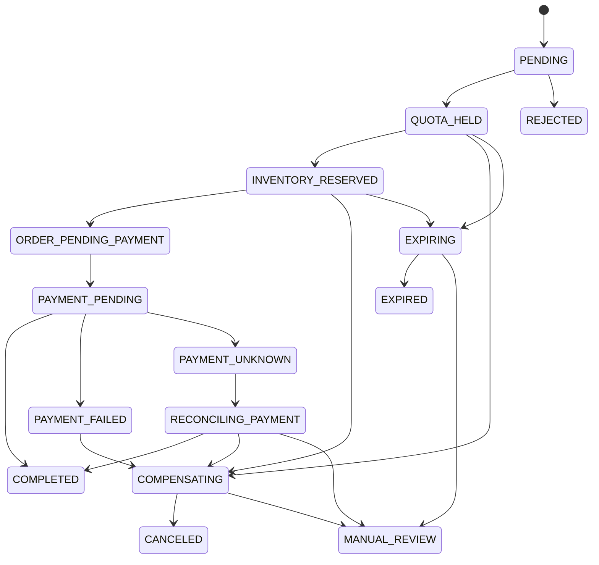

# FlashSale 技术方案（进阶版）

状态：Proposed  
基线：Medusa `develop`，commit `48a8812735f6630bcc12b3997b6d1d1f559cd492`  
目标：在不复制 Medusa 商业核心、不堆砌微服务的前提下，实现可证明并发正确性、可控制过载、可恢复故障的秒杀系统。

## 1. 方案定位

上一版并不是教学 Demo，而是一套单人约六周可完成的生产级 MVP，已经覆盖 PostgreSQL 权威状态、原子配额占用、持久化幂等、Medusa Workflow 组合与补偿、Transactional Outbox、过期回收、Reconciliation、多实例并发测试和故障注入。

本版继续解决五个真正的高级问题：

1. 热门 Campaign/SKU 的单行锁竞争；
2. Waiting Room 的公平性、重连与 Token 失效语义；
3. 旧 Token、旧 Worker 和僵尸执行者继续提交的问题；
4. 从入口到数据库、支付和异步 Worker 的全链路背压；
5. 支付超时、重复事件、局部提交后的恢复与对账。

技术深度来自对瓶颈、事务边界和失败窗口的处理，而不是技术组件数量。

## 2. 分级交付范围

### 2.1 MVP：正确性基线

- 单区域、单写 PostgreSQL；
- 数据库运行基线为 PostgreSQL 15+，生产 SQL 不依赖 PostgreSQL 16 专属函数；
- 每个 Campaign Item 一条 Capacity 记录；
- PostgreSQL 条件更新占用活动配额；
- 固定速率或固定并发 Admission；
- 持久化 Idempotency Key 与 Request Hash；
- 复用 Medusa `completeCartWorkflow`；
- Allocation TTL、补偿、Outbox、过期回收与 Reconciliation；
- 两个应用实例的真实数据库并发测试；
- 固定环境下的 open-loop k6 基准。

### 2.2 Advanced：推荐的最终作品范围

- Control、Admission、Commit 三个逻辑平面；
- Virtual Waiting Room 与可量化公平性；
- Admission Token 的 JTI、Campaign Epoch 和权威兑换；
- 固定数量的 PostgreSQL Escrow Capacity Shards；
- Materialized Balance + Append-only Capacity Movement Ledger；
- Medusa 通用原子库存预留能力；
- Worker Lease + Fencing Token；
- Payment Command、Webhook Inbox 与 `UNKNOWN` 状态恢复；
- Fixed 与 AIMD Adaptive Admission 对照实验；
- API/Worker 运行角色隔离；
- SLO、容量模型、故障恢复和 CI 性能门禁；
- Active/Passive 单写灾备演练。

### 2.3 Stretch：研究或原型范围

- Capacity Shard 在线 Split/Merge 和动态再平衡；
- 多区域 Waiting Room 的全局公平合并；
- 跨区域 Quota Escrow；
- PostgreSQL PITR 自动化；
- TLA+/PlusCal 小模型；
- 自动容量建议工具。

不实现 Active/Active Checkout、自研共识、跨数据库 2PC 或通用分布式事务框架。

## 3. 设计原则

1. PostgreSQL 是 Campaign、Allocation、Attempt、Idempotency、Ledger、Outbox 和 Worker Lease 的事实来源。
2. Medusa Inventory 是物理库存唯一事实来源。
3. Redis 只负责 Waiting Room、Admission、缓存和消息运输，不能决定最终库存或销量。
4. Campaign Quota 与 Physical Inventory 分别安全，通过幂等 Saga 最终收敛，不宣称全局 ACID。
5. 消息采用 At-least-once，通过 Inbox、唯一约束和幂等 Command 实现效果去重。
6. 外部支付不能被数据库事务包裹；支付超时表示结果未知。
7. 先通过指标证明瓶颈，再引入分片或自适应算法。
8. 恢复承诺必须写明前提，区分 Safety 与 Liveness。
9. MVP 不修改 Medusa Core；高级 Core 改造必须通用、默认行为不变并有 Contract Test。
10. 文档清楚区分 Medusa 上游能力与 FlashSale 新增能力。

## 4. 上游基础与项目增量

复用的 Medusa 能力：

- `packages/core/core-flows/src/cart/workflows/complete-cart.ts`：Cart Lock、Order、Inventory、Payment、Hook 与 Compensation；
- `packages/core/core-flows/src/cart/steps/reserve-inventory.ts`：库存锁和 Reservation 补偿；
- `packages/modules/inventory/src/services/inventory-module.ts`：库存与 Reservation；
- `packages/modules/locking` 及 PostgreSQL/Redis Provider；
- `packages/modules/workflow-engine-redis`；
- `packages/modules/event-bus-redis`；
- `packages/plugins/loyalty`：Plugin 扩展方式参考。

FlashSale 原创增量：

- Campaign 与规则版本；
- 配额账户、Escrow Shards 和 Movement Ledger；
- Waiting Room、公平调度和 Admission Lease；
- Durable Idempotency 与 Attempt 状态机；
- Checkout Saga 与绕过保护；
- Payment Command、Webhook Inbox 和未知状态恢复；
- Worker Fencing、Outbox、Reconciliation；
- Adaptive Admission、容量模型、Model-based Test 和性能/故障证据。

## 5. 总体架构

系统保持模块化单体，只有一个 Plugin 和一套代码，但逻辑上划分三个平面：



部署拓扑：

```text
N x API Role
M x Worker Role
1 x PostgreSQL Primary
1 x Redis
可选 PostgreSQL Standby / Read Replica
```

API 与 Worker 使用同一 Image，通过 `ROLE=api|worker|all` 选择运行角色。这是资源隔离，不是拆分业务微服务。

## 6. 模块边界

### 6.1 Campaign Module

负责 Campaign 生命周期、时间窗、规则版本、活动配额、单用户限购、Campaign Epoch、Admission 参数和 Kill Switch。只保存 Medusa Variant/Location 的 Opaque ID，不导入 Product/Inventory Model 或 Repository。

```text
DRAFT -> SCHEDULED -> ACTIVE -> ENDED
   \          \          \
    +----------+-----------> CANCELLED
```

影响公平或购买资格的规则在 `ACTIVE` 后不能原地修改；需要新 `rules_version`，并按策略递增 `campaign_epoch`。

### 6.2 Allocation Module

负责 Purchase Attempt、Quota Hold、Capacity Pool/Shard、Per-subject Limit、Durable Idempotency、Movement Ledger、Outbox 和 Reconciliation Audit。

Campaign Quota 是活动资格，不是物理库存副本。

### 6.3 Admission Port

实现包括：

- `DisabledAdmissionPolicy`：正确性和基准测试；
- `FixedAdmissionPolicy`：MVP；
- `AdaptiveAdmissionPolicy`：Advanced；
- `RedisWaitingRoomAdapter`：生产准入；
- `InMemoryAdmissionAdapter`：单元测试。

### 6.4 Commerce Adapter

只调用稳定的 Medusa Workflow 与 Module Interface。禁止直接读写 Medusa 表、复制 `complete-cart.ts`、给上游模型增加 FlashSale 字段，或在 Redis 中维护第二套权威库存。

### 6.5 需要抽象的接口

```text
AdmissionPolicy
QuotaRepository
InventoryReservationPort
PaymentCommandPort
EventPublisher
Clock
InvariantChecker
FaultInjector
```

普通内部 Service 不为“看起来解耦”而一律增加 Interface。

## 7. 推荐代码结构

```text
packages/plugins/flash-sale/
  src/
    modules/
      flash-sale-campaign/
      flash-sale-allocation/
    application/
      contracts/
      errors/
      state-machines/
    infrastructure/
      admission/
      commerce/
      payment/
      observability/
      fault-injection/
    workflows/
      admin/
      store/
      steps/
      hooks/
    api/
      admin/flash-sales/
      store/flash-sales/
    jobs/
      expire-allocations.ts
      dispatch-outbox.ts
      process-inbox.ts
      reconcile.ts
    subscribers/
    links/
  integration-tests/
  model-tests/
  bench/k6/
  README.md

ops/
  compose.yaml
  compose.obs.yaml
  compose.chaos.yaml
```

Route 只做身份验证、Schema Validation、错误映射和 Workflow 调用。状态转换在 Module Service；跨模块同步编排在 Workflow；异步副作用通过 Outbox/Event 完成。

## 8. 核心不变量

### 8.1 活动配额

```text
available + held + consumed = issued_quota
available >= 0
held >= 0
consumed >= 0
held + consumed <= issued_quota
```

```text
subject_active_holds + subject_consumed <= per_subject_limit
```

一个 Hold 只属于一个 Attempt；一个 Attempt Item 最多一个 Live Hold；`HELD` 只能转为 `CONSUMED`、`RELEASED` 或 `EXPIRED` 一次。

### 8.2 物理库存

对禁止 Backorder 的 FlashSale 路径：

```text
0 <= reserved_quantity <= stocked_quantity
```

每个 Live FlashSale Physical Reservation 必须对应一个 Reservation Binding。每个非成功业务终态 Attempt 在恢复边界结束后不得持有 Active Physical Reservation。

不能给整个 Medusa Inventory 表增加 `reserved <= stocked` Check，因为普通商品可能允许 Backorder。

### 8.3 幂等和稳定状态

```text
(campaign_id, subject_id, idempotency_key_hash)
最多对应一个 Logical Attempt
```

同 Key 同 Request Hash 返回已有结果；同 Key 不同 Request Hash 返回 `409 IDEMPOTENCY_CONFLICT`。

```text
COMPLETED
=> Quota CONSUMED
=> 唯一 order_id
=> 唯一 Physical Reservation Binding
=> Payment 满足完成策略
```

```text
REJECTED / CANCELED / EXPIRED
=> Quota 不处于 HELD
=> 不持有 Active Physical Reservation
```

Saga 中间状态可以暂时不满足跨模块关系，但必须可观测、可恢复。

## 9. 关键数据模型

### 9.1 Campaign

```text
id, name, state
starts_at, ends_at
rules_version, campaign_epoch
hold_ttl_seconds, per_subject_limit
admission_policy
admission_window_min/max/current
shard_count, shard_epoch
created_at, updated_at
```

`campaign_epoch` 在 Pause/Resume、Cancel、重大规则变化和灾备切换时递增，使旧 Admission Token 失效。

### 9.2 CapacityPool 与 CapacityShard

```text
CapacityPool:
campaign_item_id, total_quota, unassigned_quantity
shard_count, shard_epoch, version

CapacityShard:
campaign_item_id, shard_id
granted_quantity, held_quantity, consumed_quantity
version, state
```

```text
sum(shard.granted_quantity) + pool.unassigned_quantity = total_quota
shard.held_quantity + shard.consumed_quantity <= shard.granted_quantity
```

MVP 使用 `K=1`；Advanced 使用固定 `K=16` 或由基准决定的值。

### 9.3 PurchaseAttempt 与 AllocationHold

```text
PurchaseAttempt:
id, campaign_id, subject_id, cart_id
idempotency_key_hash, request_hash
admission_jti_hash, admission_epoch, grant_seq
capacity_shard_id, home_region
state, rules_version, order_id, expires_at, version
settlement_id, settlement_started_at
last_error_code
lease_owner, lease_until, lease_epoch
created_at, updated_at

AllocationHold:
attempt_id, campaign_item_id, capacity_shard_id
quantity, state, expires_at, version
```

Phase 1E-1 在 `QUOTA_HELD` 与业务结算之间增加保护态
`QUOTA_COMMITTING`。进入保护态时 Hold 和 Capacity/Subject Counter 仍保持
`HELD` 语义，但普通 Expiry Worker 不再回收它；只有绑定相同
`settlement_id` 的结算命令可以 Consume 或 Release。这样可以避免
`completeCartWorkflow` 已创建 Pending Order 或正在调用支付时，TTL 回收线程把同一
Quota 释放给另一位买家。

### 9.4 CheckoutExecution

`CheckoutExecution` 属于独立 Checkout Module，不与 Campaign、Allocation 或 Medusa
表建立跨模块外键。它保存服务器生成的、不可变的购物车指纹：Cart、Customer
Subject、Campaign、Rules Version、Request Hash，以及规范化后的
`(campaign_item_id, variant_id, quantity)` 子表。

`commerce_transaction_id` 在任何 Commerce 副作用发生前持久化；短 Lease 使用数据库
时间并递增 `lease_epoch`。旧 Worker 必须携带旧 Epoch 写入，因此 CAS 更新为零行，不能
覆盖接管者。Phase 1E-1 实现了 `PREPARED -> COMMERCE_PENDING`、Lease/Epoch Fence 与完成前
授权内核；Phase 1E-2A 已继续实现以下 Checkout Kernel 能力：

- 将公开 Validate Hook 的实际 Workflow Transaction ID 与持久
  `commerce_transaction_id` 精确绑定，阻止其他 Complete 调用借用 Active Authorization；
- `COMMERCE_PENDING -> COMMERCE_SUCCEEDED | COMMERCE_DEFINITIVE_FAILED |
COMMERCE_UNKNOWN` 的结果命令，以及 `COMPLETED`/`CANCELED` 终态命令；
- 成功结果唯一绑定 `order_id`，Unknown 保留 `next_reconcile_at`，结果写入原子清除
  Lease/Authorization；
- 用完整结果命令和终态命令摘要校验精确重放，旧 Worker、Version、Epoch、Transaction 或
  不同结果不能借用已持久化状态。

Phase 1E-2B1 已实现完整外层 Orchestrator：在持有同一 Cart Lock 后重新授权、调用原生 Complete、
持久化结果并驱动 Quota Settlement；Phase 1E-2B2 已实现认证 HTTP 边界、Canonical Cart Reader 与
真实 Full-app Happy Path、库存阶段完整补偿、结果未知、响应丢失/结果落库故障重放和竞态证据。
同步支付明确拒绝（当前 System Provider 无确定性 Fixture）、Webhook Inbox 与通用 Payment UNKNOWN
自动恢复仍不在当前范围。

关键约束：

- `attempt_id`、`cart_id`、服务器派生的 `command_id` 与
  `commerce_transaction_id` 分别唯一；
- 非空 `order_id` 使用 Partial Unique Index；
- Lease 字段成对出现，只有 `COMMERCE_PENDING` 可以持有 Lease，Authorization Epoch 必须等于
  当前 Lease Epoch；
- 成功、明确失败、Unknown 和终态字段组合由数据库 Check Constraint 约束；
- 原始 Idempotency Key/Token 不落库、不落日志。

### 9.4 CapacityMovement

这是小型配额转移账本，不是通用 Event Sourcing 或会计引擎。

```text
CapacityMovement:
id, capacity_id, attempt_id
campaign_id, subject_id, campaign_item_id
transition_version, kind, from_bucket, to_bucket
quantity, raw_quantity, fence_token
created_at, updated_at, deleted_at

CapacityMovementCheckpoint:
id, activation_id, capacity_id, campaign_item_id, checkpoint_kind, shard_no
opening_granted_quantity, opening_available_quantity
opening_held_quantity, opening_consumed_quantity
raw_opening_granted_quantity, raw_opening_available_quantity
raw_opening_held_quantity, raw_opening_consumed_quantity
capacity_version, activated_at

CapacityMovementControl:
id, activation_id, required_after, schema_version, checkpoint_digest

PurchaseAttempt（Movement binding）:
hold_movement_activation_id, terminal_movement_activation_id  # nullable
```

唯一约束：`(attempt_id, campaign_item_id, transition_version)`。

`transition_version` **等于该次转移完成后的 `PurchaseAttempt.version`**，不是独立的
Ledger 序号：Hold 通常为 v2；从 `QUOTA_HELD` 直接 Release/Cancel/Expire 通常为 v3；
先进入 `QUOTA_COMMITTING` 再 Consume/Release 通常为 v4。不产生 Movement 的 Attempt 转移（例如
Begin Settlement）仍会增加 Attempt Version，所以 Ledger 中的 `transition_version` 允许出现缺口，
不能按连续数量自增。

```text
hold:    AVAILABLE -q, HELD +q
consume: HELD -q, CONSUMED +q
release: HELD -q, AVAILABLE +q
expire:  HELD -q, AVAILABLE +q
```

同一事务更新 Materialized Balance、写 Movement、更新 Attempt/Hold、写 Outbox。若 Balance 与 Ledger 不一致，暂停该 Item，从 Ledger 重建派生 Counter，并记录 Repair Audit。

Phase 2A-1 已交付 append-only Movement/Checkpoint/Control schema、受限 route validator、lossless
quantity fingerprint，以及 `activateAllocationMovementLedger({})` 基线内核。`fence_token` 是对不可变
Movement identity tuple 的小写 SHA-256，用于精确重放校验；它**不是** Worker Fencing 的
epoch 或 lease token，也不能阻止旧 Worker 提交。

激活事务获取全局 advisory lock，按 ID 锁全部 live Capacity，预检 raw BigNumber/余额/Hold
聚合，为每个 Capacity 保存 opening checkpoint，计算覆盖完整 checkpoint 不可变元组的
`checkpoint_digest`，最后以单例 Control 提交切换水位；既有 Phase 1 余额不会被伪造成
Movement。首次激活要求 Movement/Checkpoint/Control 三表物理全空（包括软删除行）。精确重放
要求物理上恰好一条未删除的固定 ID Control，Checkpoint 与物理 Capacity 一一覆盖且均未删除、属于同一
Activation；`cutover.activated_at = required_after`，`provision.activated_at >= required_after`，且重算 digest 一致；任一 orphan、软删除行或内容漂移
都 fail closed。

Phase 2A-2a 已接入在线业务 writer。所有 Allocation 命令在取得其他应用锁前，先取得与激活同一
namespace 的 shared transaction advisory lock；激活取得 exclusive 形式，因此切换不会从一次余额变更
中间穿过。Hold、Consume、Release、Expire 在同一 PostgreSQL 事务内更新 Capacity/Subject/Hold/Attempt、
写 Movement 和 Outbox。Fresh transition 遇到任何 Movement 唯一键冲突都会 fail closed 并回滚；只有
明确 replay 路径可以一次读取同一 Attempt 下包含软删除行的**全部物理 Movement**，按
state/version/binding/Hold 推导允许的 Version、Kind 与 Item 精确并集，再逐行核对不可变 tuple、raw quantity
与 fingerprint；额外 version/kind/item、缺失、
重复或软删除 Movement 都 fail closed。

是否必须存在 Movement 不依赖 `created_at/updated_at` 与切换时间的比较。Attempt 使用可空的
`hold_movement_activation_id` 和 `terminal_movement_activation_id` 保存离散事实：null 表示未激活的
Legacy 转移并且禁止存在 Movement；非 null 表示必须等于当前 Control Activation，且必须存在完整
Movement 集合。Fresh Hold/终态 CAS 与 binding、余额、Movement、Outbox 在同一事务提交。

Checkpoint 使用显式 `checkpoint_kind`：激活时创建 `cutover`；激活后低频 Provision 在锁定 Control 行后
创建 `provision`，其 opening 必须是全额 AVAILABLE、HELD/CONSUMED 为 0、Capacity Version 为 1。
Fresh Provision 在创建任何新 Capacity/Checkpoint 前先验证旧的完整物理 Root，防止把既有篡改洗入新
摘要；随后读取全部物理 Checkpoint，重算并 CAS 更新 Control 的 `checkpoint_digest`；热写路径不滚动
全局摘要，只要求目标 Capacity 存在合法 Checkpoint。这样新 Campaign 可以在激活后上线，同时保留
Control Root 的可验证性。

Root Schema Version 采用兼容升级：历史 v1 digest 不含 `checkpoint_kind`，因此 v1 只允许全部为
`cutover`；当前新激活写 v2，digest 包含显式 kind。升级后可精确重放 v1；首次 Active Provision 先验证
v1 Root，再在同一 Control CAS 中升级 `schema_version=2` 并写 v2 digest，不通过 SQL 猜测或重算旧摘要。

当前证据已完成 **Phase 2A-2a/2b**：除 v2/v3/v4、精确 replay、Legacy Cutover 与单进程故障回滚外，
独立 Node 子进程会在第一条 Movement 或 Outbox `INSERT` 返回后发送已 flush 的 failpoint 握手并永久挂起；
父进程在请求仍 pending 时执行真实 `child.kill`，再用 exclusive Activation replay 而非 sleep 等待 PostgreSQL
完成 rollback，并断言 kill 已发出且进程随后退出。竞态测试为 Worker 注入唯一 PostgreSQL
`application_name`：持锁方在 shared/exclusive Movement advisory lock 或 Campaign lock 内握手暂停，父进程
只有通过 `pg_stat_activity`/`pg_locks` 观测到竞争 backend 的真实 `Lock` wait 后才 kill holder。测试因此
还要求未授予锁为 `advisory`，且 `pg_blocking_pids(contender_pid)` 包含该 holder Worker 的明确 PID，排除
同一连接池其他 backend 的误识别。测试因此确定性覆盖 Activation/Writer、Active Provision duplicate replay、First Activation/First Provision 的合法
线性化，而不是依赖 `Promise.all` 的调度巧合。生产激活仍等待 Phase 2A-3 Reconcile/Rebuild 和全实例协议确认。详见
ADR-0011、ADR-0012、`runbooks/capacity-movement-ledger-activation.md` 与 crash matrix。

带 Phase 1 旧数据的环境可以执行向上迁移：迁移新增 Movement/Checkpoint/Control 三张空表，并为
Control 增加 digest、为 Checkpoint 增加 kind、为 PurchaseAttempt 增加两个 nullable activation binding；
这些变更不改写既有业务值，基线由后续受控激活建立。反向降级只允许在三张表的物理行数都为 0
且 Attempt binding 全空（因此从未激活、从未写 Movement）时执行；
已激活或存在任何历史/软删除行时必须 fail closed，不得通过删数据来强制降级。

### 9.5 ReservationBinding、PaymentCommand 和可靠事件

`ReservationBinding` 只绑定 Attempt 与 Medusa Reservation，不复制物理库存事实。

```text
PaymentCommand:
command_id, attempt_id, operation, command_generation
provider_idempotency_key, provider_reference
status, attempt_count, next_check_at, last_error
```

约束：

- Unique `(attempt_id, operation, command_generation)`；
- Unique `provider_idempotency_key`。

Outbox 保存稳定 Event ID 与 Aggregate Version；内部 Inbox 使用 `(consumer_name, event_id)` 唯一约束；Webhook Inbox 使用 `(provider, provider_account_id, provider_event_id)` 唯一约束。

所有 Migration 通过 Module Migration Script 生成并做 no-drift 校验。唯一例外是 Movement Ledger
四个相关 `down` 的数据保护：Attempt binding、Checkpoint Kind、Digest 与 Movement 表迁移都在同一
事务内以 `ACCESS EXCLUSIVE` 锁住三表并确认物理全空后，才允许删除语义列或表；这是防止 append-only
审计证据或 replay 判定依据被回滚静默删除的显式安全硬化。

## 10. Virtual Waiting Room

### 10.1 公平性定义

不承诺严格全球 FIFO。Advanced 保证：

- 同一 Lane 内较小 `arrival_seq` 优先；
- 同一 Subject 在同一 Campaign 最多一个 Queued/Granted Lease；
- Poll/Reconnect 不改变原 Sequence；
- Subject 不能通过重连切换 Lane；
- 加权 Lane 长期 Grant Share 落在容差内；
- 低权重 Lane 的 `starvation_count = 0`。

指标包括 `queue_oldest_age`、`queue_age_p99`、`overtake_ratio`、`starvation_count` 和 Lane Grant Share。

### 10.2 Redis 数据结构

```text
wait:{campaign}:{lane}       Sorted Set, score=arrival_seq
subject:{campaign}:{subject} Queue/Grant state + TTL
inflight:{campaign}          未兑换 Lease
seq:{campaign}               单调 INCR
epoch:{campaign}             PostgreSQL Epoch 缓存
```

Lua Script 原子清理过期 Lease、按 Scheduler 选择 Waiter、增加 Inflight、生成 `grant_seq` 与 Lease Record。单 Lane 使用 FIFO；多 Lane 使用 Deficit Round Robin。

### 10.3 Admission Lease Token

```text
campaign_id
subject_id
cart_id（可选）
jti
campaign_epoch
rules_version
lane
grant_seq
shard_hint
issued_at
expires_at
region_id
```

Checkout 必须验签和 TTL，从 PostgreSQL 校验 `ACTIVE + epoch + rules_version`，并以 JTI 创建或重放 Attempt。PostgreSQL Unique JTI 是 Single Redemption 的权威保证。

Admission Lease TTL 为秒级，只允许进入 Commit Plane；Allocation Hold TTL 为分钟级。Admission Token 不是库存保证。

## 11. 热点配额与 Escrow Sharding

### 11.1 MVP 单行更新

```sql
UPDATE flash_sale_capacity
SET held_quantity = held_quantity + :quantity,
    version = version + 1
WHERE campaign_item_id = :campaign_item_id
  AND quota - consumed_quantity - held_quantity >= :quantity
RETURNING version;
```

事务内只做 Campaign 状态确认、幂等 Claim、Quota 更新、Pending Attempt/Hold、Movement、Outbox 和 Commit。禁止在锁内调用 Payment、发送消息或执行完整 Checkout。

### 11.2 Advanced 固定 Shards

单 Hot Row 的提交上限约为 `1 / 临界区平均持锁时间`。增加 App Replica 只会增加等待者，不会线性提高 Hot-key Goodput。

使用 `(campaign_item_id, subject_id)` 做 Rendezvous/Consistent Hash 选择 Primary Shard；Primary 满时只 Probe 1–2 个候选，禁止扫描所有 Shard。

比较 `K=1/4/16/32` 的 Allocation Goodput、Row Lock Wait、Deadlock Retry、Pool Refill、Quota Stranded 和 Reconciliation Mismatch。

Shard 低水位时从 Pool 领取一个 Chunk。Pool Row 只在 Refill 时锁定；应用进程不能持有未落库的本地权威 Quota。在线 Split/Merge 属于 Stretch。

## 12. 原子物理库存预留

MVP 复用 Medusa `reserveInventoryStep` 和多实例 Locking Provider。Advanced 增加通用 Core 能力：

```ts
tryCreateReservationItemsAtomic(input, options)
```

行为：

1. 按 `inventory_level.id` 排序；
2. `SELECT ... FOR UPDATE`；
3. 锁内重新读取 Stocked/Reserved；
4. 任一 Item 不足则整个事务回滚；
5. 创建 Reservation Rows；
6. 更新 Reserved Quantity；
7. 返回 Reservation IDs；
8. 同一 `reservation_key + request_hash` 返回原结果；
9. 同 Key 不同内容返回 Conflict。

使用 `READ COMMITTED + Row Lock + 固定顺序`，不默认全局 `SERIALIZABLE`。增加专用 Nullable `reservation_key` 和 Partial Unique Index，不复用语义模糊的 `external_id`。

这项改造需要默认行为不变、Contract Test、多进程测试、Backorder 兼容测试、Benchmark 和独立 ADR，优先形成通用上游 PR。

## 13. Checkout Saga 与状态机



Medusa `completeCartWorkflow` 的真实顺序不是“先库存、后订单”，而是：获取 Cart
Lock、运行公开 `validate` Hook、创建 Pending Order、并行建立 Link/更新 Cart/创建
Physical Reservation，最后 Authorize Payment。因此 FlashSale 的组合顺序固定为：

```text
Quota Hold
-> CheckoutExecution + Lease
-> Quota QUOTA_COMMITTING
-> Pending Order
-> Physical Reserve
-> Payment Authorize
-> Quota Consume
```

Quota Consume 不提供 `QUOTA_HELD -> QUOTA_CONSUMED` 直达命令。进入 Commerce
副作用前必须用稳定 `settlement_id` 执行 `beginQuotaSettlement`，随后只有同一
`settlement_id` 的 `consumeQuotaSettlement` 可以成功消费。尚未进入提交阶段且未过期的
Hold 只能通过 `cancelHeldQuota` 主动释放；数据库时钟已判定过期的 Hold 必须进入 Expiry
路径，不能被改记为主动取消。

明确失败时按已发生事实逆序补偿；支付结果未知时不释放 Quota 或库存。Quota 与
Physical Inventory 不在同一全局事务内，准确描述是二者分别安全、通过幂等 Saga
收敛。

### 13.1 Phase 1E-1 的交付边界

本阶段只交付 Checkout Safety Kernel：

- 独立 `CheckoutExecution` Module、可信 Cart 指纹、持久 Commerce Transaction ID；
- PostgreSQL Lease/Epoch Fence；
- Allocation `QUOTA_COMMITTING` 保护态和带 `settlement_id` 的结算授权；
- 注册到稳定公开接口 `completeCartWorkflow.hooks.validate` 的防绕过 Guard；
- Guard 对普通购物车透明，对活动商品、已有 Execution、多 Campaign 和依赖故障
  Fail Closed。

本阶段不实现外层 Complete Cart Happy Path，不实现 HTTP 接口，也不假装已经实现真实
Payment UNKNOWN/Webhook/Outbox/ReservationBinding。由于上游 `completeCartWorkflow`
的输入只有 `{ id }`，Validate Hook 本身无法携带 Worker Epoch；正确性契约要求后续外层
Workflow Claim Lease 后获取同一 Cart Lock，并且在不释放该锁的前提下重新执行
Epoch Fenced Authorization，再进入嵌套 `completeCartWorkflow`；Lease 必须覆盖整段短临界区。
等待 Cart Lock 期间 Lease 可能过期，因此获得锁后的重新授权是强制门槛；失败时必须释放锁并
重新 Claim。每次新 Epoch Claim 都会清除旧 Authorization，Guard 只接受与当前 Epoch 绑定的
Authorization。
本阶段 Guard 会再次原子确认
Execution 的 Active Lease、精确 Cart 指纹与 Allocation Settlement 绑定，但不宣称它能
单独替代外层锁和 Fence。

本阶段的 Full-app 证据仅覆盖真实 Public Hook 注册、上游源码顺序契约与插件装载构建；
尚未交付“外层锁 + Claim + Authorization + 嵌套 Complete Cart”的真实 Runner，也未覆盖
Payment Webhook 入口和已完成订单重放。它们属于 Phase 1E-2，在这些证据完成前不得宣称
Checkout 端到端闭环。

### 13.2 已记录的上游库存锁顺序风险

当前上游 `reserveInventoryStep` 使用
`Array.from(new Set(inventoryItemIds))` 将 Lock Key 传给 Locking Provider，没有在该步骤
显式排序。两个反向多 Item 请求可能把相反顺序交给 Provider；Provider 是否规范化顺序
不应靠 FlashSale 猜测。本阶段增加 Contract Evidence 记录该事实，但不擅自修改 Medusa
Core。后续应通过独立 ADR 和通用 Core PR 将去重后的 `inventory_item_id` 稳定升序，并验证
默认行为、Backorder、补偿和多进程并发。

### 13.3 Phase 1E-2A：Transaction-bound Permit 与结果状态机

Cart-scoped Active Lease 不能单独证明当前 `completeCartWorkflow` 调用属于 Lease Owner。
公开 `validate` Hook 的 Handler 可以从 `StepExecutionContext.transactionId` 获得实际 Workflow
Transaction，因此 Guard 必须同时核对：

```text
execution.state = COMMERCE_PENDING
lease_until > fresh database clock
completion_authorized_epoch = lease_epoch
hook transactionId = execution.commerce_transaction_id
cart/customer/campaign/rules/items/request hash/allocation settlement 全部一致
```

`commerce_transaction_id` 由服务器在 Prepare 时生成，并由专用 Bridge 作为原生
`completeCartWorkflow` 的稳定 Transaction ID。普通 Store Complete 和普通直接 Workflow
调用会得到不同 Transaction ID，即使恰逢 Owner Authorization 生效也不能借用 Permit。

Commerce 结果状态机固定为：

```text
PREPARED
  -> COMMERCE_PENDING
       -> COMMERCE_SUCCEEDED -> COMPLETED
       -> COMMERCE_DEFINITIVE_FAILED -> CANCELED
       -> COMMERCE_UNKNOWN
```

结果写入必须携带 Version、Worker、Lease Epoch、Authorization Epoch 与 Commerce Transaction
Fence，并原子清除 Lease/Authorization。成功绑定唯一 Order；明确失败记录稳定错误；Unknown
保留下一次对账时间。只有 `COMMERCE_SUCCEEDED` 后才能 Consume Quota，Consume 暂时失败时
Execution 保持可重放的 `COMMERCE_SUCCEEDED`，禁止补偿或取消可能已经支付的 Order。

客户端原始 Idempotency Key 不写库、不写日志；`command_id` 仅保存服务器派生的 64 位小写
十六进制摘要。Replay First 使用 Command Digest、Cart、Subject 与 Request Hash 精确核对。

Phase 1E-2A 只交付上述 Kernel、Guard 和 Native Complete Bridge 契约。完整外层 Workflow、
可信 HTTP 边界和真实 Full-app Happy Path 属于 1E-2B，顺序必须是：Claim Lease 后获取同一
Cart Lock，在锁内重新 Authorization，再调用绑定 Transaction 的原生 Complete。Payment
Webhook Inbox、Provider 网络 Exactly-once、通用 UNKNOWN 自动恢复、异步支付、Admission/JTI
和多 Campaign Checkout 仍明确排除。

### 13.4 Phase 1E-2B1：可执行的私有外层编排内核

B1 使用明确命名的 `FlashSaleCheckoutOrchestrator`，不把 Imperative Service 伪装成 Medusa
Workflow。这里“私有”表示尚无公开 HTTP/不可信输入边界；Package Root 导出的 TypeScript
Factory 只用于服务器装配，并不是访问控制。原因是 Workflow Constructor 不能安全表达运行时
`try/catch` 结果分类，而公开
`ILockingModule.execute` 的自动续租/AbortSignal 只能覆盖一个 Callback；把 Cart Lock 拆到多个
可独立调度的 Step 会失去可证明的锁生命周期。

Orchestrator 只接受 `ServerCanonicalFlashSaleCheckoutCommand`。该类型表示未来可信边界已经从
Core Cart、Authenticated Customer 和 Campaign Module 派生出 Cart、Subject、Rules 与精确 Item
Mapping；未来 HTTP Route 禁止把 Request Body 直接展开到此命令。Request Hash 在内核中重算，
Attempt ID、Worker ID、Lease/Lock/Reconcile 配置均由服务器产生。

执行顺序和恢复语义固定为：

```text
Replay First
-> Claim & Hold（仅当 Execution 不存在）
-> Prepare Execution
-> Begin Settlement
-> Claim Lease
-> ILockingModule.execute(raw cart_id)
     -> 锁后 fresh Lease/Epoch Re-authorization
     -> Native completeCart（持久 commerce_transaction_id）
     -> 持久化 Success / Definitive Failure / Unknown
-> Cart Lock 自动释放
-> Success: Consume + Complete
   Definite: Release + Cancel
   Unknown: 保留 QUOTA_COMMITTING，返回独立 status: "unknown"
```

等待 Cart Lock 导致 Lease 过期时不得调用 Commerce，也不得 Release Quota；下一次 Replay 由新
Epoch 接管。Commerce Success 后的 Quota Consume 或 Execution Complete 瞬时失败只留下可恢复的
`COMMERCE_SUCCEEDED`，不会补偿或取消已经成功的 Order。`COMMERCE_UNKNOWN` 不重试 Payment。

Runtime Adapter 在 `ILockingModule.execute` 的实际持锁 Callback 内生成非秘密关联 Key，并在
当前 Runtime Registry 精确绑定到 `cart_id`。Key 会作为 `parentStepIdempotencyKey` 传播，且可能
进入 Medusa Workflow Metadata；安全性不依赖 Key 保密，而依赖“当前进程活跃 Registry
Membership + 精确 Cart 绑定 + 数据库 `commerce_transaction_id` 授权”。Native Complete 必须
同时满足三者，Callback 成功或抛错都会在 `finally` 删除绑定。

Registry 不跨进程，也不从 Metadata 恢复。已持久化或已知的旧 Key 在 Callback 结束、进程崩溃
或切换 Runtime 后都不能重新打开 Scope，必须 Fail Closed。Takeover 继续使用持久化 Commerce
Transaction，但要在新的 Cart Lock Callback 中创建新绑定，并重新完成 Lease/Epoch 和数据库
Transaction 授权。

B1 仍不是公开发布门槛。Authenticated Store Route、真实 Cart Canonical Read、完整
`medusaIntegrationTestRunner` Cart/Order/Inventory/Payment 证据，以及 Route、Direct Workflow、
Webhook 的防绕过测试属于 B2。

### 13.5 Phase 1E-2B2：Authenticated Store Boundary 与 Full-app 证据

B2 固定公开入口为 `POST /store/flash-sales/{campaign_id}/checkout`，请求体严格只有
`{ "cart_id": "..." }`。Middleware 强制 Customer Session/Bearer Authentication，Subject 只取
`auth_context.actor_id`；客户端不得提交 Subject、Items、Campaign、Rules、Request Hash、Attempt、
Worker 或 Lease 配置。`Idempotency-Key` 必填，边界在校验后立即使用带 Domain Separator 的
SHA-256 派生 `command_id`，原值不写库、不写业务日志。`campaign_id` 由独立的有界字符集 Schema
校验；Store 全局 Publishable Key Middleware 与本路由 Customer Auth、严格 Body 校验都必须实际执行。

Canonical Cart Reader 通过公开 Query/Module API 读取 Cart Ownership、完成状态、Currency、Region、
Sales Channel 和 Line Items；它还从 `publishable_key_context.sales_channel_ids` 获取服务端 Key Scope，
该集合缺失、为空或不包含 Cart Sales Channel 时一律 Fail Closed。重复 Variant 数量在服务端聚合并排序。
Campaign URL 参数只是调用者的
断言：Reader 与 Guard 共用同一个候选解析函数，先用 `SCHEDULED + ACTIVE` 检测重叠并 Fail Closed，
再要求唯一候选为 `ACTIVE` 且 ID 与 URL 完全一致，最后从 Campaign Module 派生 Rules Version 和
Campaign Item Mapping。空 Cart、Custom/无法解析 Item、Owner 不匹配、已修改 Snapshot 和多 Campaign
均拒绝。Cart 不存在、Owner 不匹配和 Key 无权访问 Sales Channel 对外统一为同一 404/消息，避免所有权
枚举。

Reader 在任何 Cart Readiness、完成状态、当前 Item/Campaign 检查之前先读取 Existing Execution。只要
认证 Subject、URL Campaign、Cart、派生 `command_id` 与持久化身份完全一致，`PREPARED`、
`COMMERCE_PENDING` 及全部后续状态都使用 Execution/ExecutionItem 的不可变 Snapshot 恢复，而不从已完成
或后来变化的 Cart 重建命令；Ownership 与 Publishable Key Sales-channel Scope 仍重新校验。不同 Key 或
不同 Campaign 不能借用该恢复路径。这样 Native Complete 已提交、但 Commerce Result 落库失败时，Lease
过期后的接管者会用同一个持久化 `commerce_transaction_id` 恢复原 Workflow Result，再完成 Quota Consume
和 Execution Complete，而不会重复 Claim/Hold。

HTTP 结果只暴露四类：`completed` 为 200；仍在处理为 `in_progress`/202；不确定 Commerce 为
`unknown`/202；确定取消为 `canceled`/409。内部 `MANUAL_REVIEW` 映射为 `unknown`，Quota Reject 映射为
`canceled`，不向客户端泄露 Worker、Lease、Settlement 或 Provider 内部信息。

真实 `medusaIntegrationTestRunner` 使用 PostgreSQL、System Payment Provider 和 Plugin Build 输出，
已覆盖 Module/Route/Hook Autoload、普通 Cart 不受影响、普通 `/complete` 与 Direct Workflow 绕过拒绝、
Happy Path 单 Order/Reservation/Quota Consume、同 Key 响应丢失重放、不同 Key 同 Cart 竞态、活跃 Permit
借用拒绝、锁等待跨 Lease、过期 Lease 接管与旧 Epoch Fence、Commerce Success 后 Settlement Retry、
Native Success 到 Result Persistence 之间故障后的同 Transaction 接管恢复、Canonical Read 后 Cart
Mutation Fail Closed，以及库存阶段完整补偿。负向边界还覆盖缺失/无效 Publishable Key、缺失 Customer
Auth、额外 Body 字段、缺失/无效 Idempotency Key、无效 Campaign Path、错误 Campaign、跨 Sales Channel
Key，以及 Owner 不匹配与不存在 Cart 的不可区分响应。

库存阶段的“确定失败”不依赖错误消息，也不伪称具体库存不足。当前 Core 的物理预留失败没有稳定
`INSUFFICIENT_INVENTORY` Code；只有公开复合证据同时满足单一 Error 的 `action ===
reserveInventoryStepId`、`handlerType === INVOKE` 且 Transaction 为 `REVERTED` 时，才返回通用
`INVENTORY_STAGE_REVERTED` 并 Release Quota/Cancel Execution。支付阶段、Generic Throw、补偿未完成或
Cart Mutation Guard 拒绝都归 `UNKNOWN`，继续保留 `QUOTA_COMMITTING`。

B2 的 Full-app Fixture 使用 System Payment Provider，只证明同步成功和上述库存阶段完整补偿；它不提供
可确定的同步支付拒绝或 Webhook Fixture。因此本阶段仍明确排除 Guest、Async/Requires-more Payment、
Provider Webhook Inbox/Dedupe、通用 UNKNOWN Reconciler、Provider 网络 Exactly-once、Admission/JTI、
Multi-campaign Checkout 和 Cross-region Checkout。Webhook 绕过的独立端到端证据留待具备确定性 Provider
Fixture 后补充；当前公开 Validate Hook 的 Direct Workflow 绕过证据不等价于已完成 Webhook 证明。

本地 Full-app 门禁先设置 PostgreSQL `DB_HOST`、`DB_USERNAME`、`DB_PASSWORD`，再在
`packages/plugins/flash-sale` 执行 `yarn test:full-app`；脚本会先运行 `build:plugin`，因为 Medusa Plugin
Loader 加载 `.medusa/server/src`，不会直接加载源目录。



所有转换使用 `state + version + optional fence token` 做 CAS。`MANUAL_REVIEW` 不是业务终态，只表示自动恢复停止并等待人工处理。

## 14. 支付 UNKNOWN 与 Webhook

Payment 超时不能视为失败。`UNKNOWN` 状态下：

1. 不创建新 Payment Session；
2. 不更换 Provider Idempotency Key；
3. 等待 Webhook；
4. 查询 Provider；
5. 在 Uncertainty Grace Period 内保留 Reservation；
6. 超过预算后进入 `MANUAL_REVIEW` 或执行明确配置的释放策略。

Provider 支持 Authorize/Capture 分离时先 Authorize，订单与 Allocation 稳定后再 Capture。若只能 Auto-capture，迟到成功需要幂等 Refund，不能重新创建订单掩盖库存已经释放。

Webhook 入口先验签、提取稳定 Event ID、写 Inbox，持久化后返回 2xx。Unique Conflict 也返回 2xx。Worker 通过 CAS 更新 Attempt/Payment 并写 Outbox。

## 15. Worker Lease 与 Fencing

短任务使用 `FOR UPDATE SKIP LOCKED`。需要长期持有资源的 Worker 使用 PostgreSQL Lease：

```sql
BEGIN;
SELECT id FROM purchase_attempt WHERE id = :id FOR UPDATE;
-- 必须在行锁等待结束后再读取；now()/transaction_timestamp() 会固定在事务起点。
SELECT clock_timestamp() AS fresh_now;
UPDATE purchase_attempt
SET lease_owner = :worker,
    lease_until = :fresh_now + :lease,
    lease_epoch = lease_epoch + 1
WHERE id = :id
  AND (lease_until IS NULL OR lease_until < :fresh_now OR lease_owner = :worker)
RETURNING lease_epoch;
COMMIT;
```

后续写入必须包含 `lease_owner` 和 `lease_epoch`。新 Worker 接管后 Epoch 增加，旧 Worker 恢复也无法提交。

Fencing 用于 Expiry、Reconciliation、Outbox Claim/Mark 和长时间 Shard Ownership，不应该加到所有普通同步事务。Fencing 不能撤回已经发出的支付 HTTP 请求，外部副作用仍依赖 Stable Command、Provider Idempotency 和状态查询。

## 16. Outbox、Inbox 与补偿

### 16.1 Phase 1F-A 已实现：Allocation 原子 Producer 与数据库状态机

Allocation 现在把 `QUOTA_HELD`、`QUOTA_REJECTED`、`QUOTA_COMMITTING`、
`QUOTA_CONSUMED`、`QUOTA_RELEASED` 和 `QUOTA_EXPIRED` 的版本化事件，与对应
Attempt/Hold/Counter 状态在同一 PostgreSQL Transaction 提交。唯一键为
`(purchase_attempt, attempt_id, aggregate_version)`；Event Hash 覆盖完整 immutable canonical envelope；其中
Item ID 使用 UTF-16 code-unit 字典序（显式 `<`/`>`，不使用 locale-sensitive comparator），
但不覆盖随机 Event ID 和数据库时间。重放只验证并返回已有事件，不重复追加；同版本内容漂移会让事务失败。

数据库投递状态机已经提供 `PENDING -> PUBLISHING -> PUBLISHED`、Retry、Dead Letter、受控 Redrive、
`FOR UPDATE SKIP LOCKED`、Lease Epoch Fencing 和按 Aggregate Head-of-line。`OUTBOX_REQUIRED` 激活水位之后，
业务重放缺少当前 Version 事件时 Fail Closed；水位前 Legacy Row 是明确豁免，不能据此宣称历史完整。

`QUOTA_RELEASED` Payload 区分 `held_cancel` 与 `settlement_release`。Payload 不保存 Subject、Idempotency/
Request/Command 值或摘要、Token、Worker/Lease、Payment 或原始异常。

### 16.2 Phase 1F-B1 已实现：Allocation Redis Dispatcher

生产 Dispatcher 只通过 Allocation 的公开 exact commands 工作：短事务 Claim 后立即释放 PostgreSQL 行锁，
在事务外调用 EventBus；只有 `@medusajs/event-bus-redis` 的 `emit` 成功返回后才执行带 Worker/Epoch 的 fenced Mark。
Redis Provider 的返回仅表示 BullMQ Queue 已接受，不表示 Subscriber 已成功。若接受之后 Mark 超时、抛错或进程
崩溃，事件保持 `PUBLISHING`，Lease 到期后以同一 Event ID/Hash 重投；绝不在已收到接受回执后调用 Failure 命令。

Dispatcher 默认禁用，启用前同时检查 Worker/Shared Mode、Redis Provider 明确声明、全部六种 Canonical Event 与
Exact Subscriber ID Manifest，以及 `mark budget + safety margin < lease`。事件名不能重映射，Wildcard 也不能代替
逐事件 Exact Registration。Local/Unknown/Custom Provider、Server Mode、缺失/未知 Subscriber 或不安全预算都会在
Claim 前 Fail Closed，因此零事件被认领。
每个 Tick 最多 Claim `concurrency` 个事件并立刻并发处理，`allSettled` 隔离 Poison Event；进程内 overlap guard 只用于
削峰，正确性仍来自数据库 Lease/Fencing。EventBus 网络等待期间不持有 PostgreSQL Outbox 行锁。

测试工程另有一个明确标注为 **test-only probe** 的 Consumer Module。它独占自己的 Inbox、Projection Cursor 和
Effect 表；Subscriber 对完整 Envelope 做严格 Schema/Canonical Hash 验证，并在单个本地事务内写 Inbox、业务 Effect
和 Cursor。完全相同的重复 Event 会增加 Delivery Count 但不重复 Effect；同 Event ID 漂移、同 Aggregate Version
冲突、Version Gap 和未知旧版本均 Fail Closed。它证明了一个具体 Consumer 的本地 Effect Deduplication，不会随生产
Plugin 注册，也不是通用 Production Inbox。

真实 Redis/PG Full-app Fixture 已覆盖：正常接受后 `PUBLISHED`；接受后、Mark 前崩溃导致同 ID/Hash 重投且 Effect
只提交一次；Redis 网络中断时 Pending `emit` 不写 `PUBLISHED`、不持 PG 行锁，恢复后原 Owner 被 Epoch Fence，
Takeover 重投排空；Inbox 两个事务 Failpoint 全回滚；100 路同事件并发只有一个 Effect。Fixture 使用唯一 Queue、OS
动态 Proxy 端口，要求显式 `FLASH_SALE_TEST_REDIS_URL`；Proxy 晚于 Medusa/EventBus 关闭，不回退 Local Provider，
也不会对共享 Redis 执行 `FLUSH*`。

### 16.3 Phase 1F-B2 已实现：Checkout 原子 Producer 与公平多 Lane Dispatch

CheckoutExecution 新增独立于技术 CAS `version` 的 `business_version` 与 `outbox_stream_started`。新 Execution 在
`prepare` 的同一事务写 `checkout.prepared.v1`，从业务版本 1 开始；迁移前 Legacy Row 保持 `false/0` 豁免，第一次
真实业务转换才原子启动版本 1。Lease Claim/Takeover、Authorize 和只读重放不会递增业务版本，也不会发事件；只有
`PREPARED/COMMERCE_UNKNOWN -> COMMERCE_PENDING` 会发 `checkout.commerce_pending.v1`，PENDING Lease Takeover 不发。
其余已实现事实是 `commerce_succeeded`、`commerce_definitive_failed`、`commerce_unknown`、`completed`、`canceled`。

Checkout 独占自己的 Outbox Event/Control 表、激活水位、Claim/Mark/Fail/Redrive 与 Reconciliation，没有读取 Allocation
表，也没有中央跨模块事务。业务 CAS、`business_version + 1` 与 immutable Outbox Append 在同一个 Checkout
`SqlEntityManager` 事务内完成；Append 前或 Append 后 Commit 前故障均整体回滚，响应丢失重放返回同一 Event ID/Hash。
Payload 只包含 Execution/Attempt/Campaign/Rules/State、UTF-16 code-unit 排序 Items，以及适用状态下的 Order ID 或
受限 Error Code；不包含 Subject、Cart、Command/Request/Idempotency 值或摘要、Commerce Transaction、Worker、Lease、
Epoch、Payment、Token 或原始异常。

激活后，所有业务重放及 `readExecutionReplay`、`readCartCompletionAuthorization`、`findExecutionForCart`、Authorize/Result
入口都会验证当前业务版本事件；缺失或漂移时 Fail Closed。Reconciliation 检查 started/watermark、连续版本、ahead/gap、
Hash/Catalog 与合法状态转换，但不会假装重建迁移前历史。

单一 `flash-sale-dispatch-outboxes` Job 通过模块本地 Port 调度 Allocation 与 Checkout，不做 Union SQL。启用 Checkout
Lane 时，Redis Provider 和两个 Catalog 的 Canonical Event→Exact Subscriber ID Manifest 必须全局预检通过后才允许
任一 Lane Claim。全局并发预算为 `C`：`C=1` 在 Tick 间轮转；`C >= Lane 数` 时每 Lane 至少一个，余量继续轮转；总
Claim/Publish 不超过 `C`。一个 Lane 的数据库故障用 `allSettled` 隔离，不改变另一 Lane 已成功的工作；Ack/Fail 始终
路由回事件所属模块。系统不声明跨模块全局顺序。

Test-only Probe 把 `source_module` 纳入 Inbox/Effect/Cursor Identity；Allocation 第一条可见版本仍是 2，Checkout 从 1
开始。真实 Redis Full-app 已证明认证 Store Checkout 产生一个 Order/Reservation，Allocation 三个事实与 Checkout 四个
事实可按任意跨模块顺序进入 Probe；Checkout accepted-before-mark 以同一 ID/Hash 重投，Delivery Count 增至 2 而 Effect
只提交一次。技术 `version` 可因 Authorize/Takeover 出现空档，业务版本仍连续。

### 16.4 Phase 1F-B2 尚未保证

当前能力是模块本地 Atomic Producer、显式 Redis/BullMQ Queue Acceptance，以及测试 Probe 的事务效果去重；它不把
Queue Acceptance 误称 Subscriber Success，也不保证 Redis AOF/RDB、Replication、HA、跨 Region 灾备或运维质量。
没有 Production Consumer Inbox、Exactly-once Delivery、跨模块顺序、Campaign Outbox、Webhook Inbox/Dedup、通用
Payment UNKNOWN Reconciler、死信运维 API 或通用 Schema Registry。Redis reconnecting `emit` 没有外层 Deadline；
晚到 Acceptance 仍会产生重复投递，恢复依赖模块本地 Lease/Fencing 和消费者稳定 ID 去重。

当前仅有每 Tick、每 Lane 的低敏感度结构化计数日志；Backlog/Oldest-age、Publish Latency、Retry/Dead/Fenced Metrics
仍是后续工作，不宣称完整可观测性。

补偿必须按当前事实决定：

| 已发生事实                 | 补偿策略                                |
| -------------------------- | --------------------------------------- |
| 只有 Quota Hold            | Quota 返回 AVAILABLE                    |
| Quota + Reservation        | 先释放 Reservation，再释放 Quota        |
| Order 已创建、支付明确失败 | Cancel Order 并释放资源                 |
| Authorization 成功         | 优先 Void                               |
| Capture 成功但订单失败     | Refund、Cancel Order、释放资源          |
| Payment UNKNOWN            | 不猜测、不重新扣款，进入 Reconciliation |
| Compensation 超时          | 使用同一 Command ID 重试或查询          |

## 17. 分层 Reconciliation

### Level 1：Plugin 内部

检查 Balance/Ledger、Hold/Attempt、终态残留 Quota 和缺失 Outbox。纯派生数据允许 Safe Repair。

### Level 2：Medusa 绑定

检查 Reservation Binding、Completed Attempt 的唯一 Order、Canceled/Expired Attempt 的残留 Reservation，以及 Quantity 一致性。物理库存不一致时先暂停相关 Item，不能猜测修复。

### Level 3：Payment Provider

检查 UNKNOWN Command、Provider Reference、Late Capture 和 Refund/Void。Provider 不可查询时不能推断失败。

Repair Mode 分为 `dry-run`、`safe-repair`、`manual-required`，每次操作记录 Evidence、Action、Version 和 Before/After。

## 18. 分层背压

### 18.1 Edge/API

- 限制 Connection、Body Size、Subject/IP Abuse Rate；
- Queue 满时快速返回，不保留无限长连接；
- IP 只能作为 Abuse Signal，不能作为用户身份。

### 18.2 Waiting Room

- `max_queue_depth`；
- `max_queue_age`；
- 全局与 Per-campaign Grant Window；
- 带 Jitter 的 `Retry-After`。

### 18.3 API Process

- Global Semaphore；
- Per-campaign Semaphore；
- Event-loop Queue 有界；
- 超出 Budget 时 Fail Fast。

### 18.4 Commit Plane

- API 与 Worker 使用独立 PostgreSQL Pool Budget；
- Transaction Deadline 与 Lock Timeout；
- Deadlock Retry 有总预算；
- Payment Provider 使用独立 Bulkhead；
- 一个请求沿调用链传递同一个 Deadline，禁止每层重新获得完整 Timeout。

### 18.5 Async Worker

- 有界 Batch 与 Concurrency；
- Outbox Oldest Age、Expiry Lag 驱动扩缩；
- Backlog 时不能无限拉取；
- Reconciliation 不能长时间锁表。

扩容 API Replica 不能绕过数据库 Hot Row。总 Admission Budget 不能随着 Replica 数量无约束放大。

## 19. Adaptive Admission

MVP 先运行 Fixed Limit；Advanced 再启用小型 AIMD Controller。

输入信号：

- Reserve p95；
- PostgreSQL Pool Wait；
- Quota Transaction Duration；
- Hot-key Lock Wait；
- Timeout/5xx；
- Node Event-loop Lag。

控制策略：

```text
健康：每个周期 limit + 1
轻度过载：limit * 0.8
Timeout / Pool Exhaustion：limit * 0.5
限制 min/max，设置 cooldown
Campaign 激活时使用保守 cold start
```

发布顺序：

1. Disabled；
2. Shadow，只记录 `would_reject`；
3. Fixed；
4. 10% 流量 Adaptive；
5. 25% -> 50% -> 100%。

Controller 只影响进入 Commit Plane 的速率，不参与配额或库存正确性。

对照实验比较 No Admission、Fixed、Adaptive，在 0.5 倍到 2–3 倍持续容量下观察 p99、Goodput、429、5xx、Pool Timeout 和 Lock Wait。

## 20. 容量模型

| 变量            | 含义                               |
| --------------- | ---------------------------------- |
| `S_quota`       | Quota Transaction 平均服务时间     |
| `S_inventory`   | Inventory Reservation 平均服务时间 |
| `S_payment`     | Payment Command 平均服务时间       |
| `C_db_api`      | API 可用数据库连接                 |
| `C_db_worker`   | Worker 可用数据库连接              |
| `lambda_in`     | 请求到达率                         |
| `lambda_commit` | 成功提交率                         |
| `W_lock`        | Row/Lock Wait                      |
| `Q_admission`   | Waiting Room 长度                  |
| `U_db`          | PostgreSQL CPU/Pool Utilization    |
| `T_sellout`     | Quota / Commit Rate                |

使用 Little's Law 检查隐藏队列：

```text
系统内平均请求数 L 约等于 到达率 lambda * 平均停留时间 W
```

如果观测 Inflight 与预测明显不一致，通常存在未观测的 Node Promise Queue、Pool Queue、Lock Wait 或 Provider Queue。

需要输出：

- 1/2/4 Replica 在单 Hot Key 下的扩展曲线；
- 1/2/4 Replica 在 10/100 Key 下的扩展曲线；
- K=1/4/16/32 Capacity Shard 曲线；
- Offered Load 与 Goodput/Latency/Rejection 的关系。

目标是解释系统瓶颈，而不是只展示一个最大 QPS。

## 21. 多区域与灾备边界

### 21.1 MVP

- 单 Region；
- PostgreSQL Backup/Restore Drill；
- Redis 可重建；
- 发布真实 RPO/RTO；
- 不声称 Multi-region。

### 21.2 Advanced Active/Passive

Primary Region 承担 Admission Grant、Checkout、Allocation、Medusa Write 和 Payment Command。Secondary Region 只提供 Stale-ok Campaign/Catalog Read，Standby 时不发 Grant。

Failover：

1. 提升 PostgreSQL Standby；
2. 获取新的 `deployment_epoch`；
3. 递增 Active Campaign Epoch；
4. 启动新 Region Admission；
5. 旧 Region Token 因 Region/Epoch 不匹配被拒绝；
6. 已持久化 Attempt 通过 Idempotency 查询或重放。

DR 期间 Waiting Room Position 可以丢失，但业务正确性不能丢。接口标注 Consistency Class：

- `stale-ok`：公开 Campaign 页面；
- `read-your-writes`：刚创建的 Attempt；
- `strong-primary`：Capacity、Admin、Checkout、Payment。

不实现 Active/Active Checkout，因为 Order、Inventory、Payment 仍属于单写一致性域。

## 22. API 契约

Admin：

- `POST /admin/flash-sales`
- `PATCH /admin/flash-sales/{id}`
- `POST /admin/flash-sales/{id}/schedule`
- `POST /admin/flash-sales/{id}/activate`
- `POST /admin/flash-sales/{id}/pause`
- `POST /admin/flash-sales/{id}/resume`
- `POST /admin/flash-sales/{id}/cancel`
- `GET /admin/flash-sales/{id}/capacity`
- `POST /admin/flash-sales/{id}/reconcile?mode=dry-run`

Store：

- `POST /store/flash-sales/{id}/admissions`
- `GET /store/flash-sales/{id}/admissions/{admission_id}`
- `POST /store/flash-sales/{id}/checkout`（URL Campaign 仅作断言，真实 Campaign 与规则由服务端 Cart Snapshot 推导并精确核对）
- `GET /store/flash-sales/{id}/attempts/{attempt_id}`

Admission Response 包含 `queue_position_estimate`、`poll_after_ms`、`token`、`lease_expires_at` 和 `campaign_epoch`。Queue Position 必须明确为估算值。

稳定错误码：

- `FLASH_SALE_NOT_ACTIVE`
- `ADMISSION_EXPIRED`
- `STALE_ADMISSION_EPOCH`
- `ADMISSION_ALREADY_REDEEMED`
- `CAPACITY_EXHAUSTED`
- `PURCHASE_LIMIT_EXCEEDED`
- `IDEMPOTENCY_CONFLICT`
- `COMMIT_PLANE_OVERLOADED`
- `LOCK_TIMEOUT_RETRYABLE`
- `PAYMENT_STATE_UNKNOWN`
- `REGION_NOT_WRITABLE`

429 表示 Admission Limit，503 表示 Commit Plane 暂不可用。客户端不能盲目重放支付请求，应先查询 Attempt。

## 23. 故障语义

| 故障                            | 预期行为                                         |
| ------------------------------- | ------------------------------------------------ |
| Quota Hold 后进程死亡           | Attempt 保持可恢复中间态，Expiry/Reconciler 释放 |
| Physical Reservation 后进程死亡 | Binding 保留，Reconciler 继续或释放资源          |
| Order Commit 后响应丢失         | 同 Idempotency Key 返回原 Attempt/Order          |
| Payment 已执行但请求超时        | 标记 UNKNOWN，使用同一 Command 查询或等 Webhook  |
| Webhook 重复                    | 一条 Inbox 业务效果提交，重复返回 2xx            |
| Webhook 乱序                    | 状态不回退，必要时查询 Provider                  |
| Publisher 在 Ack 后崩溃         | Event 重发，Consumer Inbox 去重                  |
| Redis 丢失                      | Admission 降级或拒绝，不破坏 PostgreSQL 不变量   |
| 多 Item 最后一项不足            | 整个事务回滚，不留下部分 Hold                    |
| Expiry 与 Payment Success 竞争  | CAS/Fence 决定唯一写入者，失败方重读并补偿       |
| 旧 Worker 恢复                  | Fence Token 更新零行，不能覆盖新 Worker          |
| PostgreSQL Deadlock/Timeout     | 回滚，有限次数 Backoff + Jitter                  |
| Provider 长期不可用             | 保持 UNKNOWN/MANUAL_REVIEW，只保证安全           |
| Broker 长期不可用               | Outbox Backlog 增长并报警，业务 Commit 不回滚    |

## 24. Safety 与 Liveness 边界

只要 PostgreSQL 事务语义正常，始终保证：

- Campaign Quota 不超发；
- Atomic Inventory Path 不超卖；
- 一个 Idempotency Key 不产生两个 Logical Attempt；
- 一个 Payment Operation 不产生两个本地 Command；
- 旧 Lease Owner 不能提交新状态；
- Redis 丢失不破坏上述属性。

在 PostgreSQL 可用且至少一个 Worker 健康时：

- Expired Hold 在 `lease timeout + 2 x expiry interval` 内处理；
- Stuck Internal Saga 在 `lease timeout + 2 x reconciliation interval` 内重新 Claim；
- Broker 恢复后 Outbox 按 Drain Rate 收敛；
- Duplicate Webhook 在第一次成功处理后收敛。

Payment Provider、PostgreSQL 或 Broker 无限期不可用、永久网络分区和 Manual Review 无法承诺固定恢复时间。

## 25. 可观测性与 SLO

复用 Medusa OpenTelemetry，不引入第二套 Tracing SDK。

关键 Trace：Admission、Checkout、Quota、Inventory、Order、Payment、Compensation、Expiry、Reconciliation。

关键 Metric：

- `admission_grants_total`
- `admission_window`
- `queue_depth`
- `queue_oldest_age_seconds`
- `overtake_ratio`
- `starvation_count`
- `capacity_shard_lock_wait_seconds`
- `shard_probe_count`
- `quota_stranded`
- `commit_inflight`
- `deadline_exhausted_total`
- `idempotency_replay_total`
- `compensation_failure_total`
- `lease_fence_rejection_total`
- `outbox_oldest_unpublished_age_seconds`
- `reconciliation_mismatch_total`
- `payment_unknown_total`

禁止把 Campaign、Customer、Cart、Attempt、Order 或 Idempotency Key 放入 Metric Label。Hot-key 排查使用 Sampled Trace、Top-K 周期日志或 Exemplar。

初始验收 SLO：

- Oversell、Duplicate Order、Quota Mismatch：0，无 Error Budget；
- 合法 Commit Request 非 5xx 至少 99.9%；
- Admitted Request p95 小于 250 ms、p99 小于 500 ms，最终按基线校准；
- 99% Expired Allocation 在两个 Sweep Interval 内释放；
- Internal Interrupted Workflow 在 60 秒内恢复或被 Reconciliation 检出；
- 429 单独报告，不能从 Availability 中隐藏。

## 26. 测试策略

### 26.1 Unit 与 Decision Table

- Campaign、Attempt、Payment Command State Machine；
- Time Window、Epoch、Per-subject Limit；
- Idempotency Request Hash；
- Lock Key 排序；
- DRR Scheduler；
- Retry Budget；
- Metric Label Cardinality。

### 26.2 Model-based Property Testing

使用 `fast-check` 建模 Quota Buckets、Attempt、Reservation、Order、Payment Command、Lease Epoch、Outbox/Inbox，并随机执行 Retry、Hold、Reserve、Payment Success/Failure/Timeout、Duplicate Webhook、Expire、Crash Worker、Lease Takeover、Outbox Retry 和 Reconcile。

每一步检查不变量，并将失败序列 Shrink 为最小 Counterexample。Property Test 不能替代真实数据库并发测试。

### 26.3 PostgreSQL 多实例测试

- 两到四个独立进程竞争同一 Quota/Inventory；
- Quota 50、500 个并发 Attempt，至少重复 10 轮；
- 同一 Idempotency Key 并发 20 次；
- K=1/4/16/32 Shard 对照；
- Reversed Multi-item Lock Order；
- Lock Timeout、Transaction Abort、Stale Fence；
- Outbox Publisher 多实例；
- Expiry、Confirm、Cancel 并发；
- Migration Upgrade。

### 26.4 Waiting Room 测试

- 100,000 Waiter；
- Poll/Reconnect 不改变 Arrival Sequence；
- Subject 不能占多个位置；
- DRR 1:4:1 长期份额在容差内；
- 低权重 Lane Starvation 为 0；
- Pause/Resume 后旧 Epoch Token 全部拒绝；
- API 从 2 扩到 10 Replica，总 Admission Budget 不膨胀。

### 26.5 Failpoint 与 Chaos

Failpoint：

- `after_attempt_created`
- `after_quota_held`
- `after_inventory_reserved`
- `after_order_committed`
- `after_payment_sent_before_response`
- `after_outbox_publish_before_mark`
- `during_expiry_release`

环境故障：Redis Restart、Kill Replica、PostgreSQL 延迟、DB Timeout、Payment UNKNOWN、新旧 Schema/Code 并行，以及 Reconciliation 与业务流量并行。

TLA+/PlusCal 只作为 Stretch：Spec 小于约 200 行、TLC 在 CI 运行、状态与代码一一映射、Counterexample 转为回归测试。不使用 Jepsen 测试单 PostgreSQL 依赖。

## 27. 基准与压测可信度

同时使用 Closed Model/VUs 和 Open Model/`constant-arrival-rate`。必须披露 `dropped_iterations`，避免压测工具不足被误认为服务稳定。

矩阵：

- 1/2/4 App，单 Hot Campaign；
- 2/4 App，10/100 Campaign；
- 0%/20% Idempotent Retry；
- 80%/95%/99% 请求集中同一 SKU；
- 50/100/250/500 requests/s；
- Redis Down 与 PostgreSQL Latency；
- No/Fixed/Adaptive Admission；
- K=1/4/16/32 Shard。

每轮 Warm-up 30–60 秒、测量 2–3 分钟、至少重复三次，报告 Median 和 Min/Max，保存 Raw JSON，并记录环境、版本、配置、数据集和 Commit SHA。

Release Gate：

- `oversell_count = 0`；
- `duplicate_business_result_count = 0`；
- `reconciliation_mismatch_count = 0`；
- 稳态 Unexpected 5xx 小于 0.1%；
- 同机 A/B Median p95 退化超过 15% 且超过噪声阈值时失败；
- Sustainable Goodput 下降超过 10% 时失败；
- Load Generator 未饱和；
- 测试后运行数据库 Invariant Checker。

## 28. CI/CD、灰度与恢复演练

PR Pipeline：Lint/Typecheck/Build、Unit/Model Test、PostgreSQL/Redis Integration、HTTP Smoke、Migration Up、低负载 k6 Correctness Gate、Image Build 与漏洞扫描。

Nightly/Release Candidate：多实例并发、Failpoint、Toxiproxy、No/Fixed/Adaptive A/B、K=1/K=16 A/B、Schema Upgrade、Backup/Restore、可选 Soak Test。

灰度顺序：Disabled、Shadow、10%、25%、50%、100%。任一 Correctness Invariant、Compensation Failure、5xx Burn、p95 退化、Pool/Lock Wait 异常都会停止发布。

回滚只切换应用 Image SHA，Schema 使用 Expand-Contract，不执行破坏性 Down Migration。

恢复演练：备份 PostgreSQL、恢复到隔离环境、执行 Migration、运行 Invariant Checker、比较业务记录、恢复 Workflow 或运行 Reconciliation，并记录真实 RPO/RTO。

## 29. 安全模型

- Checkout 绑定已认证 Customer 或服务器签发的 Guest Subject；
- Admin API 复用 Medusa RBAC；
- Admission Token 短 TTL、签名、Campaign/Subject/Region/Epoch 绑定；
- JTI 单次兑换；
- Price、Quota、Limit、Rules Version 由服务端计算；
- Subject 不能访问其他人的 Attempt；
- Idempotency Key 长度、字符集、Retention 有界；
- 不记录 Token、Payment Data、Raw Webhook、Raw JTI、Raw Idempotency Key；
- Threat Model 覆盖 Replay、Enumeration、Queue Bypass、Bot Burst、Token Theft、Quota Bypass 和 Admin Misuse。

## 30. 实施路线

### Phase 0：仓库理解与基线，3–4 天

跑通 Medusa Cart/Inventory/Payment 测试，绘制 Workflow 与锁边界，建立 Hot-key 基准，确认 Payment Provider 能力。

### Phase 1：MVP 正确性内核，约两周

状态：**已完成**。2026-09-21 在提交 `a3ea114968b0262bc14edb2f7a1229453ae533da` 上通过
4 个独立 Node 子进程、Quota 50、每轮 500 个并发 Allocation Command、连续 10 轮的正式正确性门禁；
50/500 主竞争场景累计 500 Held、4,500 Capacity Exhausted、零意外；Quota 与 Same-key 证据中
零重复业务身份，所有被测 Allocation 场景零 Reconciliation Issue；
同时通过 Checkout 单 Order/Reservation 的响应丢失与竞态回归。详见
`docs/flashsale/benchmarks/phase-1-correctness-gate-2026-09-21.md`。

Plugin、Campaign、Attempt、Hold、条件 Quota Claim、Idempotency、Checkout Composition、Expiry、Reconciliation、
Allocation/Checkout 各自的原子 Outbox Producer/数据库投递状态机、公平多 Lane Redis Queue Acceptance Dispatcher、
两实例并发测试，以及 test-only Transactional Inbox/Effect Probe。Production Consumer Inbox 不属于当前 1F-B2 交付。

退出条件：Quota 50、500 并发、10 轮零超发、零重复、零对账差异。

### Phase 2：高级可靠性，约两周

Movement Ledger、Atomic Inventory Primitive、Reservation Binding、Payment UNKNOWN、Production Consumer/Webhook
Inbox、Campaign Outbox、Worker Fencing、Model-based Test 和 Failpoint Matrix。

当前进度：Phase 2A-2a/2b 已完成 Movement Ledger schema、baseline/cutover、事务内在线 writer、
滚动 Provision Checkpoint Root、单进程故障回滚与多进程真实 kill/crash/race 矩阵；
Reconcile/Rebuild/Repair 属于 2A-3。

退出条件：关键崩溃点恢复后满足声明的 Safety 与有条件 Liveness。

### Phase 3：性能与过载控制，约两周

Waiting Room、Epoch Token、Fixed Admission、Layered Backpressure、Capacity Model、Escrow Shards、AIMD 和完整对照实验。

退出条件：在两倍 Offered Load 下保持零不变量错误，并证明 p99、5xx、Pool Wait 或 Goodput 改善。

### Phase 4：SRE 与作品化，约一至两周

OpenTelemetry、SLO、CI Performance Gate、Canary Rollback、Backup/Restore、Active/Passive Failover Drill、Demo、Benchmark Report 和 Release Tag。

总周期约 7–8 周。若只有六周，优先完成 Phase 1、Phase 2，再从 Escrow Sharding 与 Adaptive Admission 中选择一条深入完成。

## 31. Demo 设计

1. 并发正确性：两个 Replica、Quota 100、1,000 个 Hot-key Attempt、20% 重试，展示零超发、零重复和零 Drift。
2. 热点与过载：K=1/K=16、No/Fixed/Adaptive 对照，展示 Goodput、p99、Lock Wait 和 Pool Timeout。
3. 故障恢复：在 Reservation 或 Payment UNKNOWN 后 Kill Worker，新 Worker 获得更高 Fence，旧 Worker 无法提交。
4. 工程交付：10% Canary 注入性能回归，Gate 停止发布并切回旧 SHA，Schema 与已有 Attempt 保持可读。

## 32. 简历证据

最终数字必须来自可复现实验。

候选 Bullet：

> 为 Medusa 设计并实现高并发 FlashSale 插件，通过 PostgreSQL 原子配额账本、幂等状态机和数据库原子库存预留，在 N 个应用实例、M 次突发请求下保持零超发、零重复订单，并达到 X requests/s、Y ms p95。

> 构建基于排队延迟、数据库连接池和锁竞争反馈的 Adaptive Admission Controller；在两倍 Offered Load 下，将 p99 从 X 降至 Y、数据库超时率从 A% 降至 B%，同时保持业务 Goodput 与全部正确性不变量。

> 实现 Outbox/Inbox、Payment UNKNOWN Recovery、Worker Fencing 和分层 Reconciliation，并通过 Model-based Test、真实 PostgreSQL 多进程测试和故障注入，在 N 轮进程崩溃与依赖故障中维持零状态漂移。

证据包括 ADR、多实例 CI Artifact、Raw k6 JSON、Invariant Checker、Failure Matrix、Restore 记录、Release Tag、一键 Compose，以及通用 Medusa Core 改造的 PR 或 Contract Test。

## 33. 不应加入的过度设计

- 同时加入 Kafka、Redis Streams、BullMQ 和数据库 Outbox；
- 声称 Redis 与 PostgreSQL 原子扣减；
- 声称 Exactly-once Payment/Event；
- 拆出 5–8 个业务微服务；
- 自研 Raft 或跨区域 Active/Active；
- 复制一套物理库存；
- 所有表都加 Fencing Token；
- 全局 SERIALIZABLE 并省略幂等/补偿；
- 把 Movement Ledger 做成通用会计框架；
- Payment UNKNOWN 后更换 Key 重新扣款；
- 把 Admission Queue 当库存保证；
- 只跑 Mock Test 却声称多实例零超卖；
- 在无数据时宣称百万 QPS 或金融级容灾。

## 34. ADR Backlog

1. Plugin 边界与 Medusa Core 复用；
2. Campaign Quota 与 Physical Inventory 的 Saga 边界；
3. Idempotency Scope、Hash 和 Retention；
4. Campaign Epoch、Admission JTI 与 Single Redemption；
5. Waiting Room 公平性与 DRR；
6. Escrow Sharding 与 Refill；
7. Atomic Inventory Reservation；
8. Attempt/Payment 状态机与 UNKNOWN；
9. Worker Lease 与 Fencing；
10. Outbox/Inbox At-least-once 契约；
11. Safe Repair 与 Manual Review；
12. Adaptive Admission；
13. API/Worker Resource Isolation；
14. Expand-Contract 与 Image Rollback；
15. Active/Passive Failover 与 Epoch Fencing。

## 35. 实施前确认项

- 是否强制登录，还是支持 Guest Subject？
- 普通订单是否与活动订单共享物理库存？
- Admission 只是尝试资格，还是必须保证库存？
- Demo 使用哪个 Payment Provider？是否支持稳定 Event ID、Idempotency、Authorize/Capture 和 Query API？
- Redis 故障时默认 Fail-closed，还是允许受数据库预算保护的小流量 Fallback？
- 3DS 允许多长 Allocation TTL？
- Advanced 优先证明 Escrow Sharding，还是 Adaptive Admission？
- Atomic Inventory Primitive 是否作为独立上游 PR？

默认假设：已认证 Buyer、普通订单与活动订单共享物理库存、Admission 不保证库存、活动高峰 Redis Admission Fail-closed、Allocation TTL 五分钟、单区域单写。改变这些假设必须新增 ADR。
